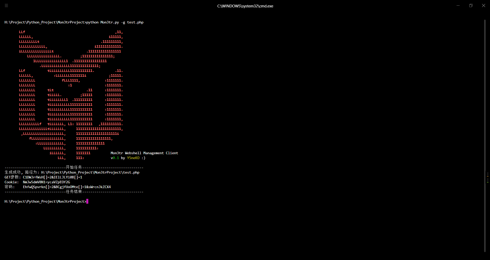
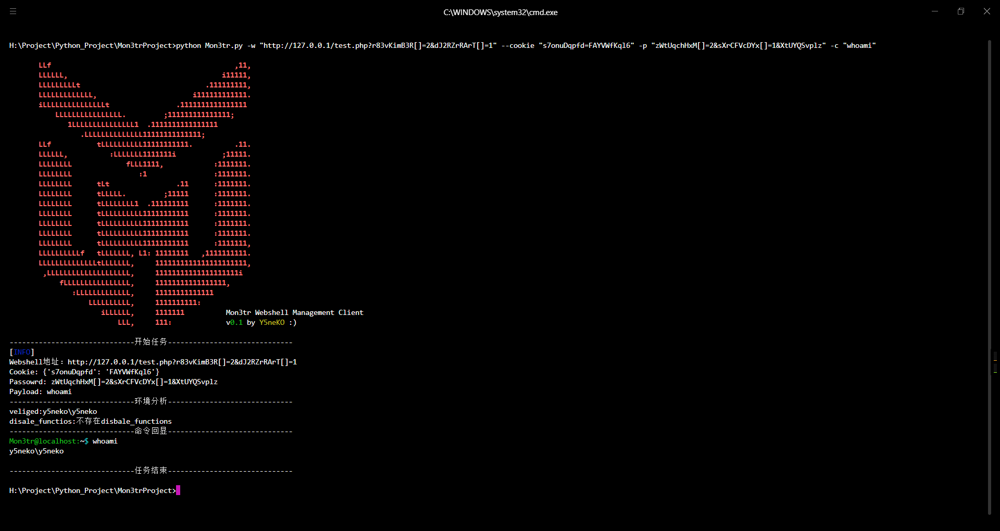
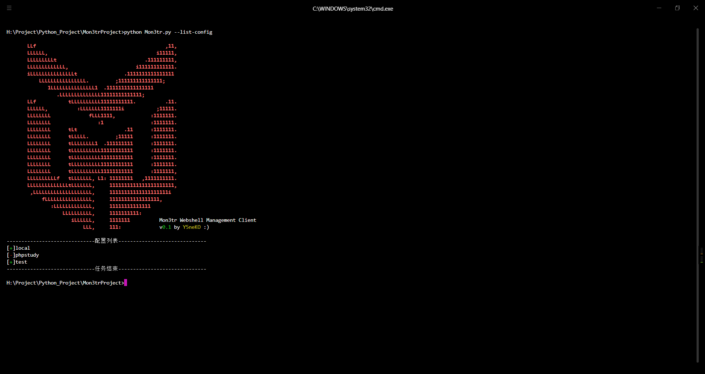

<h1 align="center">Mon3trProject</h1>
<center></center>
<p align="center">
  Mon3tr流量加密客户端,名字取自<b>Arknights® Mon3tr</b>
  <br><br>
  
  <br><br>
  <a href='https://blog.ysneko.com'></a>
  <a href='https://www.python.org'></a>
  <br><br>
  <a href="#">
    
  </a>
  <a href="#">
    
  </a>
</p>


## Mon3tr - Webshell Management Client

目前仅用作个人用途，因此开发方向主观性较强，且代码比较随意(菜)，欢迎大佬们提Issue或者pull完善算法.


## 版本&更新日志
**版本** v0.1

- *2022.07.31* | 发布了 v0.1 测试版本；当前仅支持php，只支持提交流量加密，后续完善.

- *2024.03.14* | 发布了 v0.1 正式版本；当前仅支持php，实现了webshell管理基础功能.

- ~ | 功能更新中

## 默认配置

`Python 3_8_0`  |  `PyCharm 2023.2.3`  |  `UTF-8`

## 目录描述

`core`: 核心功能目录

`log`:程序日志目录

`webshells`:连接配置目录

## 快速开始

**稳定版**：

功能无异常的发布版本。

```sh
wget {请从Release下载}
cd Mon3trProject
python3 -m pip install -r requirements.txt
python3 Mon3tr.py
```

**开发版**：

主要用于作者个人编程使用的的开发版本，可能存在Bug或者因为代码未编写完而出现异常的情况

```sh
git clone https://github.com/Y5neKO/Mon3trProject
cd Mon3trProject
python3 -m pip install -r requirements.txt
python3 Mon3tr.py
```

## 使用说明

```sh
       LLf                                            ,11,      
       LLLLLL,                                     i11111,      
       LLLLLLLLLt                              .111111111,      
       LLLLLLLLLLLLL,                       i111111111111.      
       iLLLLLLLLLLLLLLLt                .1111111111111111       
           LLLLLLLLLLLLLLLL.         ;111111111111111;          
              1LLLLLLLLLLLLLLL1  .1111111111111111              
                 .LLLLLLLLLLLLLL11111111111111;                 
       LLf           tLLLLLLLLLL11111111111.          .11.      
       LLLLLL,          :LLLLLLL1111111i           ;11111.      
       LLLLLLLL             fLLL1111,            :1111111.      
       LLLLLLLL                :1                :1111111.      
       LLLLLLLL      tLt                .11      :1111111.      
       LLLLLLLL      tLLLLL.         ;11111      :1111111.      
       LLLLLLLL      tLLLLLLLL1  .111111111      :1111111.      
       LLLLLLLL      tLLLLLLLLLL11111111111      :1111111.      
       LLLLLLLL      tLLLLLLLLLL11111111111      :1111111.      
       LLLLLLLL      tLLLLLLLLLL11111111111      :1111111.      
       LLLLLLLL      tLLLLLLLLLL11111111111      :1111111,      
       LLLLLLLLLLf   tLLLLLLL, L1: 11111111   ,1111111111.      
       LLLLLLLLLLLLLLtLLLLLLL,     1111111111111111111111,      
        ,LLLLLLLLLLLLLLLLLLLL,     11111111111111111111i        
            fLLLLLLLLLLLLLLLL,     11111111111111111,           
               :LLLLLLLLLLLLL,     11111111111111               
                   LLLLLLLLLL,     1111111111:                  
                      iLLLLLL,     1111111          Mon3tr Webshell Management Client 
                          LLL,     111:             v0.1 by Y5neKO :)

usage: Mon3tr.py [-h] [-g GENERATE_WEBSHELL] [-w WEBSHELL] [--cookie COOKIE] [-p PASSWORD] [-s SAVE] [-x XOR] [-c CMD] [--list-config]

Mon3tr Webshell Management Client

optional arguments:
  -h, --help            show this help message and exit
  -g GENERATE_WEBSHELL, --generate_webshell GENERATE_WEBSHELL
                        生成webshell的文件名
  -w WEBSHELL, --webshell WEBSHELL
                        webshell路径
  --cookie COOKIE       Cookie值(格式: User=123;Pass=456)
  -p PASSWORD, --password PASSWORD
                        Webshell密码
  -s SAVE, --save SAVE  保存Webshell配置
  -x XOR, --xor XOR     xor加密key
  -c CMD, --cmd CMD     执行命令
  --list-config         列出Webshell配置
```

### 生成webshell



### 命令执行



### 列出配置




## 贡献者

<a href="https://github.com/Y5neKO/Mon3trProject/graphs/contributors">
  
</a>


## 贡献者们

[](https://github.com/Y5neKO/Mon3trProject/stargazers)


## 使用许可
[MIT](LICENSE) © Y5neKO

